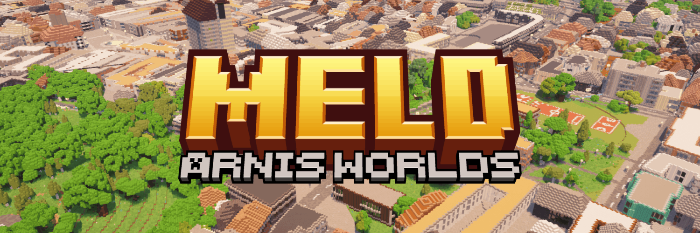

<div align="center">



# Arnis worlds, at scale

The real world in Minecraft, from a city block to a whole country.
**Meld 1.9.0 "Unbound"** is a standalone desktop app: download, run, generate.

&nbsp;
&nbsp;
&nbsp;
&nbsp;

[**Download**](https://github.com/Teddy563/meld/releases/latest) &nbsp;·&nbsp;
[meldmc.com](https://meldmc.com) &nbsp;·&nbsp;
[Docs](https://meldmc.com/docs) &nbsp;·&nbsp;
[Live demo](https://meldmc.com/demo) &nbsp;·&nbsp;
[Changelog](CHANGELOG.md)

</div>

---

## What Meld is

[Arnis](https://github.com/louis-e/arnis) turns real OpenStreetMap data into a Minecraft build,
one area at a time, and one instance of it can only go so big.

Meld exists because a whole country doesn't fit in one generator. It cuts your selection into a
grid of cells, runs **an Arnis per cell in parallel**, as many as your machine can carry, then
**melds** the results into a single seamless world: no seams, no duplicated terrain, no edges
where two instances disagreed. It began as a way to render all of Romania; what it took to do
that is now what anyone gets, for any place.

**Draw an area on a map. Press Generate. Open the world in Minecraft.** That's the whole loop.

## What Meld is not

- **Not a mod or a plugin.** It writes ordinary Java Edition worlds (Anvil `.mca`, plus Linear /
  B_Linear for servers). Vanilla clients and servers open them with nothing installed.
- **Not a schematic library.** Everything is generated from real map data (OpenStreetMap,
  Overture buildings, real elevation) at the scale you choose, 1:20 up to 1:1.
- **Not a cloud service.** Everything runs on your machine, and after baking a region's data it
  runs fully offline. Nothing is uploaded anywhere.
- **Not Bedrock.** Java Edition worlds only.

## Get it

Grab the archive for your OS from the [latest release](https://github.com/Teddy563/meld/releases/latest),
extract it anywhere, and run **Meld**. No installer, no Python, nothing to uninstall: deleting
the folder removes it. Meld lives in the tray with a floating status bar; the full UI opens in
its own window when you want it.

> The builds are unsigned: Windows shows SmartScreen once (*More info → Run anyway*), macOS needs
> *System Settings → Privacy & Security → Open Anyway*.

Meld keeps itself current. It notices new releases, downloads and verifies them, and switches
over only after the new version has proven it starts, with the old one kept. The Arnis generator
inside updates on its own schedule too.

## What you get

- **Country scale.** The grid + merge is the point: selections that no single generator could
  hold render as one world. Progress, retries and per-cell health are visible the whole way.
- **A bake that knows its cost.** Before generating, Meld prices the memory, disk and time a
  region needs against your actual machine, with measured numbers instead of guesses, and
  refuses, with the fix named, when something won't fit.
- **Data fetched for you.** *Get the data for this region* picks the right country extracts from
  Geofabrik's own index; a continent-sized file is offered only with its true size and a memory
  warning. Baked OSM + elevation packs make re-renders instant and offline.
- **Presets.** A world's look (scale, terrain, trees, climate, caves, textures) as one file
  you can share. Machine-specific settings are stripped, so a recipe from a big desktop is safe
  on a laptop. Three tuned starters ship in the box.
- **The fork's generator.** Meld drives a [custom Arnis fork](https://github.com/Teddy563/arnis)
  with vanilla-style caves, farmland texture, tile-invariant rendering, road detail modes,
  props, rail tunnels and more, kept **0 commits behind upstream by decision**: every upstream
  change is triaged, the useful ones ported, the rest declined with written reasons.
- **Server-ready.** Export to Linear/B_Linear, or let Meld stage a ready-to-run Leaf server with
  the world, plugins and border zones in place.

## Running from source (optional)

The app is the recommended path. If you want the repo instead:

```bash
git clone https://github.com/Teddy563/meld.git
cd meld
pip install -r requirements.txt
python meld_launch.py        # fetches the right generator binary on first run
```

Python 3.10+. `pip install osmium` enables offline `.pbf` baking from source (the app ships with
it built in). Generation is CPU-bound: keep workers × threads at or under your cores; the
**Recommend** button tunes this to your machine.

## More

- [meldmc.com](https://meldmc.com): the site, docs and live demo
- [CHANGELOG.md](CHANGELOG.md): full history; [`docs/`](docs/) holds per-release deep dives
- [`docs/README-detailed.md`](docs/README-detailed.md): the long form of this page

## Credits

Built on the open source [Arnis](https://github.com/louis-e/arnis) generator by **louis-e**,
the idea this whole project stands on. Meld drives a
[custom fork](https://github.com/Teddy563/arnis) for the shared OSM prefetch and the
position-based rendering that makes tiles line up. Respect the upstream Arnis license.

Tree models by **[paleozoey](https://www.planetminecraft.com/member/paleozoey/)**, bundled and
placed with attribution; the artistry is theirs.

Map data © [OpenStreetMap](https://www.openstreetmap.org/copyright) contributors; buildings from
[Overture Maps](https://overturemaps.org); elevation via [Mapterhorn](https://mapterhorn.com)
and regional open-data providers.

Not affiliated with Mojang AB or Minecraft.
